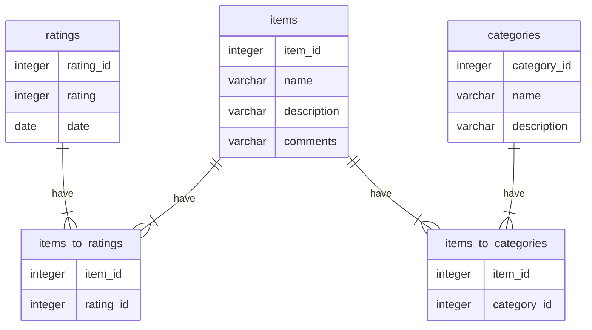

# Schema Design

## Context and Problem Statement

We need a defined schema for our application that balances normalization without
getting too tunnel-visioned on efficiency.
It should represent Items filled with metadata and local user ratings to start.

## Design Options

One option is going with `ITEM`'s that can have multiple `CATEGORY`'s. If we choose
to store ratings as a simple number and doing the parsing later,
that saves us another data structure.

We'll have an `items`, `categories` and `ratings` table - with two joining tables that link
`items` to `ratings` and `items` to `categories`.

