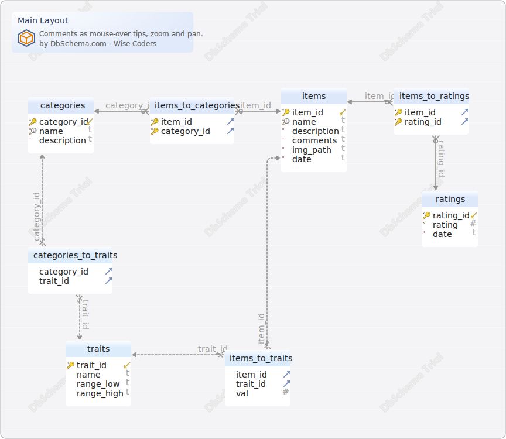

#Main Layout
Generated using [DbSchema](https://dbschema.com)

### Main Layout

### Table Default.categories 
| | | |
|---|---|---|
| * &#128273;  &#11019; | category\_id| INTEGER  |
| * &#128269; | name| VARCHAR(255)  |
| * | description| TEXT  DEFAULT '' |

##### Indexes 
| | | |
|---|---|---|
| &#128273;  | pk\_categories | ON category\_id|
| &#128269;  | unq\_categories\_name | ON name|

### Table Default.categories_to_traits 
| | | |
|---|---|---|
| &#11016; | category\_id| INTEGER  |
| &#11016; | trait\_id| INTEGER  |

##### Foreign Keys
| | | |
|---|---|---|
|  | fk_categories_to_traits | ( trait\_id ) ref [Default.traits](#traits) (trait\_id) |
|  | fk_categories_to_traits_0 | ( category\_id ) ref [Default.categories](#categories) (category\_id) |

### Table Default.items 
| | | |
|---|---|---|
| * &#128273;  &#11019; | item\_id| INTEGER  |
| * &#128269; | name| VARCHAR(255)  |
| * | description| TEXT  DEFAULT '' |
| * | comments| TEXT  DEFAULT '' |
| * | img\_path| TEXT  DEFAULT 'default.png' |
| * | date| TEXT  DEFAULT CURRENT_TIMESTAMP |

##### Indexes 
| | | |
|---|---|---|
| &#128273;  | pk\_items | ON item\_id|
| &#128269;  | unq\_items\_name | ON name|

### Table Default.items_to_categories 
| | | |
|---|---|---|
| * &#128273;  &#11016; | item\_id| INTEGER  |
| * &#128273;  &#11016; | category\_id| INTEGER  |

##### Indexes 
| | | |
|---|---|---|
| &#128273;  | pk\_items\_to\_categories | ON item\_id, category\_id|

##### Foreign Keys
| | | |
|---|---|---|
|  | fk_items_to_categories | ( item\_id ) ref [Default.items](#items) (item\_id) |
|  | fk_items_to_categories_0 | ( category\_id ) ref [Default.categories](#categories) (category\_id) |

### Table Default.items_to_ratings 
| | | |
|---|---|---|
| * &#128273;  &#11016; | item\_id| INTEGER  |
| * &#128273;  &#11016; | rating\_id| INTEGER  |

##### Indexes 
| | | |
|---|---|---|
| &#128273;  | pk\_items\_to\_ratings | ON item\_id, rating\_id|

##### Foreign Keys
| | | |
|---|---|---|
|  | fk_items_to_ratings | ( rating\_id ) ref [Default.ratings](#ratings) (rating\_id) |
|  | fk_items_to_ratings_0 | ( item\_id ) ref [Default.items](#items) (item\_id) |

### Table Default.items_to_traits 
| | | |
|---|---|---|
| &#11016; | item\_id| INTEGER  |
| &#11016; | trait\_id| INTEGER  |
|  | val| INTEGER  |

##### Foreign Keys
| | | |
|---|---|---|
|  | fk_items_to_traits | ( item\_id ) ref [Default.items](#items) (item\_id) |
|  | fk_items_to_traits_0 | ( trait\_id ) ref [Default.traits](#traits) (trait\_id) |

### Table Default.ratings 
| | | |
|---|---|---|
| * &#128273;  &#11019; | rating\_id| INTEGER  |
| * | rating| INTEGER  |
| * | date| TEXT  DEFAULT CURRENT_TIMESTAMP |

##### Indexes 
| | | |
|---|---|---|
| &#128273;  | pk\_ratings | ON rating\_id|

##### Constraints
| | |
|---|---|
| Cns_ratings_rating |  rating &lt;= 5 AND rating &gt;= 0 |

### Table Default.traits 
| | | |
|---|---|---|
| * &#128273;  &#11019; | trait\_id| INTEGER  |
|  | name| VARCHAR(100)  |
|  | range\_low| VARCHAR(255)  |
|  | range\_high| VARCHAR(255)  |

##### Indexes 
| | | |
|---|---|---|
| &#128273;  | pk\_traits | ON trait\_id|

